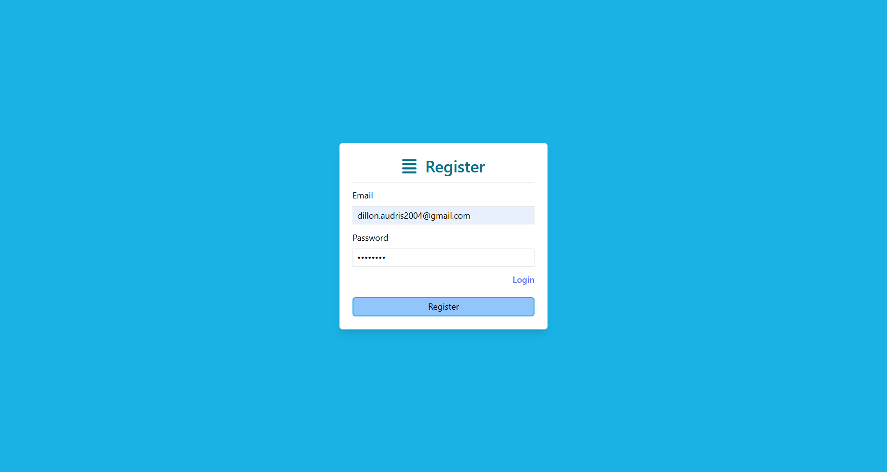
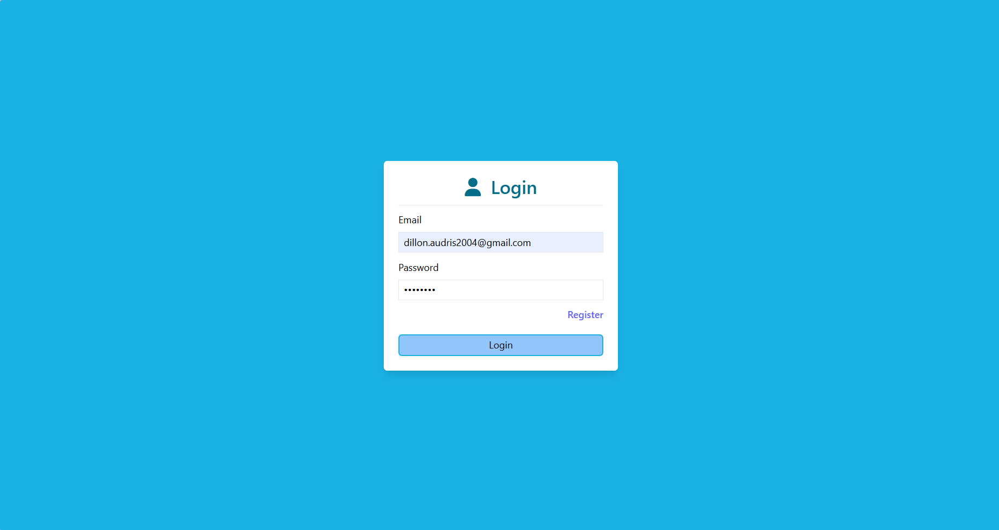
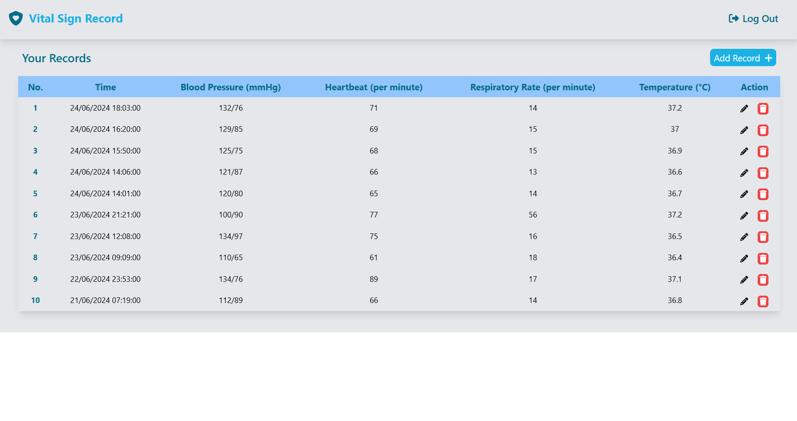
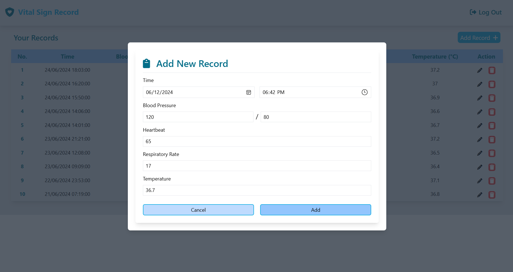
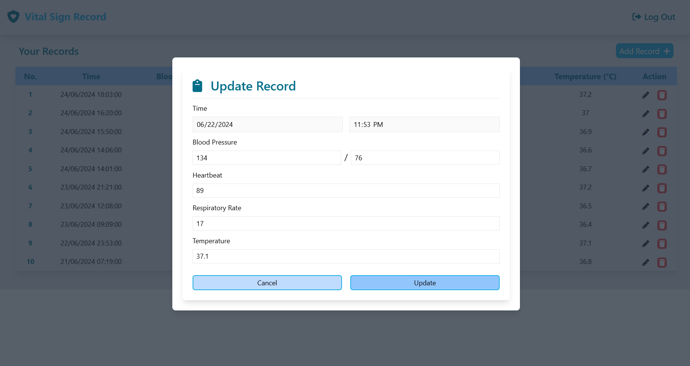

# Vital-Sign-Record-Frontend
> Frontend side for simple vital sign recording using Vue3, Vite, and TailwindCSS

## General Information
This program is created to record user vital sign that consists of blood pressure, heartbeat, respiratory rate, and body temperature! This vital sign is crucial to maintain life-health balance and detect potential disease. Vital sign records can also help by giving deeper insight to your body.

## Project Structure
```bash
.
├─── .vscode
│   └─── extensions.json
├─── src
│   ├─── api
│   │    └─── index.js
│   ├─── assets
│   │    └─── tailwind.css
│   ├─── components
│   │    ├─── AddRecordForm.vue
│   │    ├─── Navigation.vue
│   │    ├─── Popup.vue
│   │    └─── UpdateRecordForm.vue
│   ├─── pages
│   │    ├─── HomePage.vue
│   │    ├─── LoginPage.vue
│   │    └─── RegisterPage.vue
│   ├─── router
│   │    └─── index.js
│   ├─── scripts
│   │    ├─── App.js
│   │    ├─── Home.js
│   │    ├─── Login.js
│   │    └─── Register.js
│   ├─── services
│   │    ├─── AuthValidations.js
│   │    ├─── RecordDataValidations.js
│   │    ├─── TimeFormatter.js
│   │    └─── Validations.js
│   ├─── store
│   │    ├─── modules
│   │    │    ├─── auth
│   │    │    │    ├─── actions.js
│   │    │    │    ├─── getters.js
│   │    │    │    ├─── index.js
│   │    │    │    └─── mutations.js
│   │    │    └─── records
│   │    │         ├─── actions.js
│   │    │         ├─── getters.js
│   │    │         ├─── index.js
│   │    │         └─── mutations.js
│   │    ├─── constant.js
│   │    └─── index.js
│   ├─── App.vue
│   └─── main.js
├─── .env.example
├─── .gitignore
├─── docker-compose.yml
├─── Dockerfile
├─── index.html
├─── package-lock.json
├─── package.json
├─── postcss.config.js
├─── README.md
├─── tailwind.config.js
└─── vite.config.js
```

## 🔣 &nbsp;Logic and Authentication
Record logic and authentication mechanism are implemented on back-end side. Further implementation stated on [this repository](https://github.com/GoDillonAudris512/Vital-Sign-Record-Backend.git)

## ⚙️ &nbsp;How to Run the Program
Clone this repository from terminal with this command
``` bash
$ git clone https://github.com/GoDillonAudris512/Vital-Sign-Record-Frontend.git
```

### Run the application on development server
1. Create a .env file inside the repository directory using .env.example file as the template. You can keep the variables as it is.
2. Install needed dependencies using this command
    ``` bash
    npm install
    ```
3. Run the server using this following command
    ``` bash
    docker compose up
    ```
4. You can also run the server without docker using this following command
    ``` bash
    npm run dev
    ```
If you do it correctly, the front-end server should be running. You can also check the server by opening http://localhost:5173/auth/login . Don't forget to also run the back-end side. Further explanation on how to run the back-end development server stated on [this repository](https://github.com/GoDillonAudris512/Vital-Sign-Record-Backend.git
)

## 📸 &nbsp;Screenshots







## Authors
Created by Go Dillon Audris